### Local
Bruno confirmou para dia 06/12 (Primeira Sexta de Dezembro);

### Músicas
Fazer transição de acordo com o horário, começar com sertanejo, pop rock, etc e ir avançando até o Techno/eletrônic/etc noite a dentro;

### Comida
Um buffet de petisco ou algo assim.
Ideia de pegar a pizza e cortar em porção;

### Bebida
Orçamento para Ativa Solar (<u>50 convidados</u>)
Valor: R$1.850,00 (37 reais por pessoa)
Drink’s inclusos: Caipirinha de limão, caipirinha de Abacaxi, caipirinha de morango e pinã colada
Incluso:
- 5 horas de open bar
- ⁠toda compra de bebidas, frutas e o que mais for necessário
- ⁠bartenders uniformizados formalmente a disposição para fazer os drinks
- ⁠Copos personalizados com dados da confraternização/dados 
- ⁠decoração do balcão
SOBRE O PAGAMENTO
50% do valor adiantado para garantir reserva da data e compromisso de ambas partes, restante do valor podendo ser pago na semana do evento

### Tema
Sunset
Colocar Neon e Led para fazer iluminação
- Varal de Luzes 
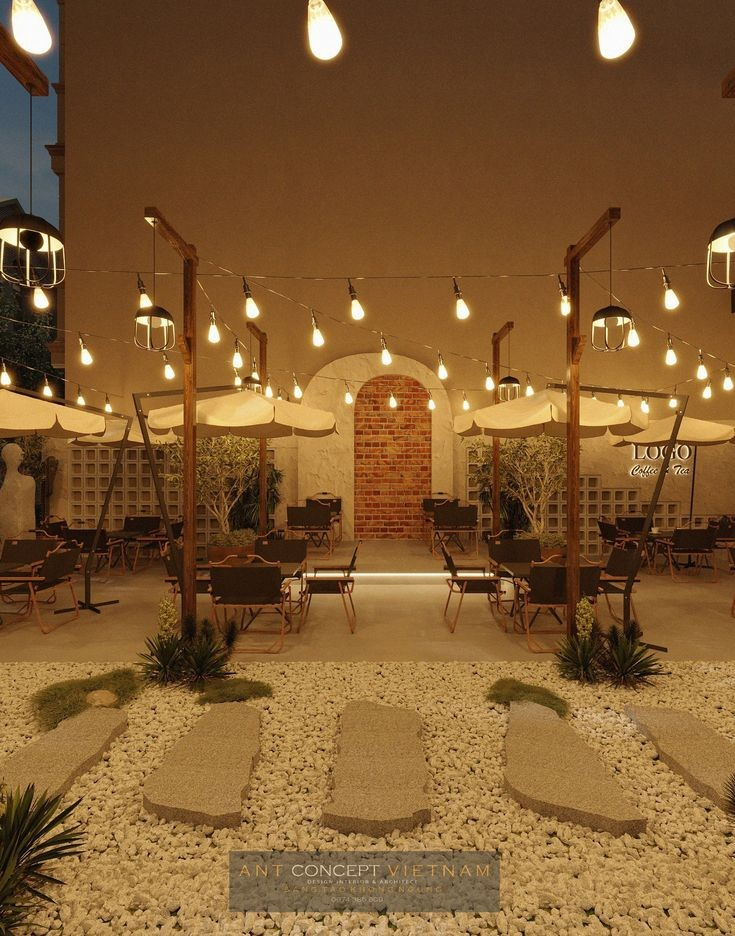
 - Velas?
 - Projetor - provavelmente não, não combina com música ao vivo;
 - Placas decorativas - Podemos fazer com materiais simples como cartão ou algo mais complexo, como placas de compensado e paletes, se me derem alguns dias (horário de trabalho) e materiais posso tranquilamente fazer algumas; 
 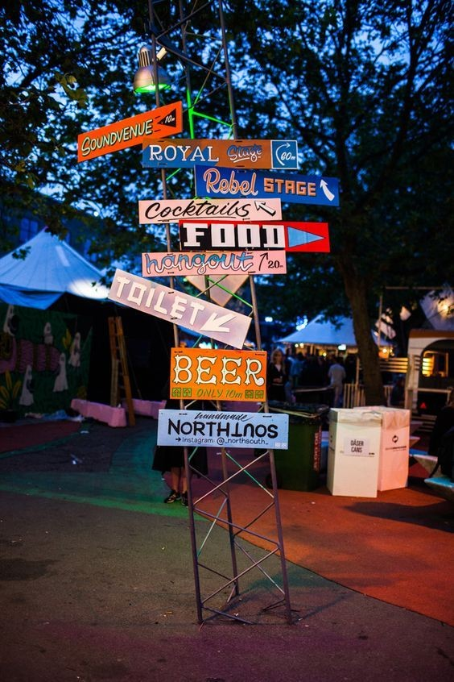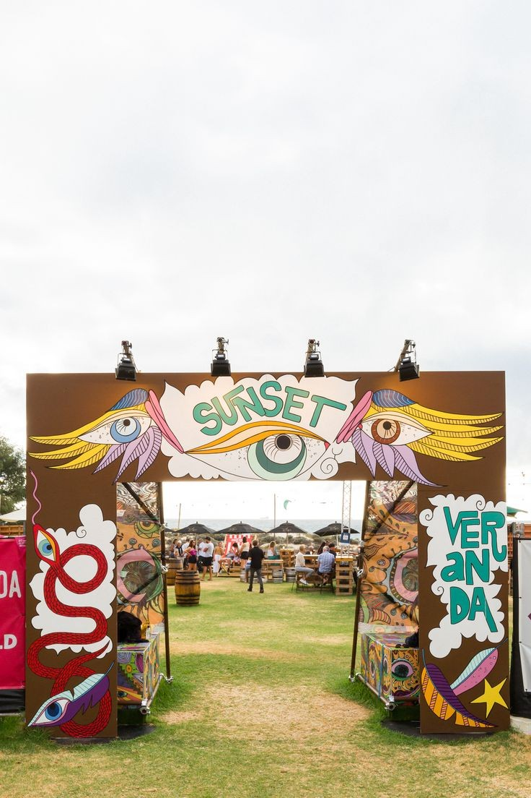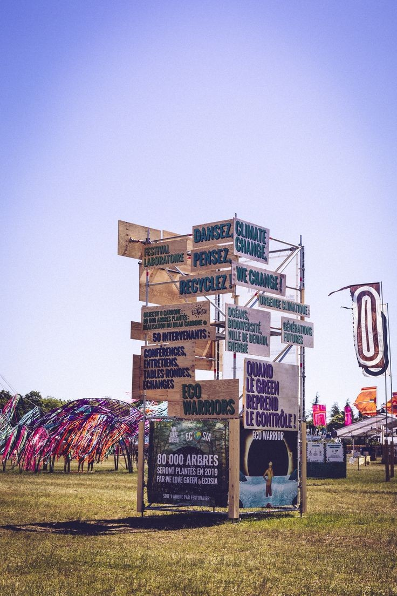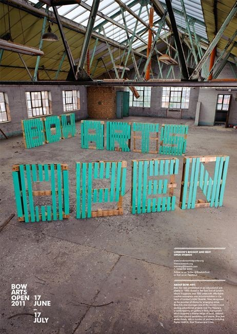
 - Outro detalhe comum são as lonas esticadas;
 - Bruno comentou que a Luiza não gostou da ideia de barquinhos com vela na água, mas podemos colocar jarras com velas na borda; 
 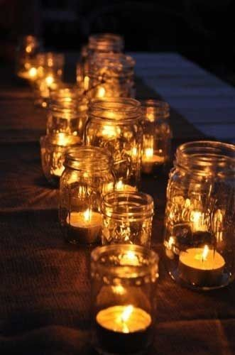
 - Iluminar o caminho? estrada da porta/entrada até a festa; (mesma ideia de cima);
 - Tocha tiki?; 
 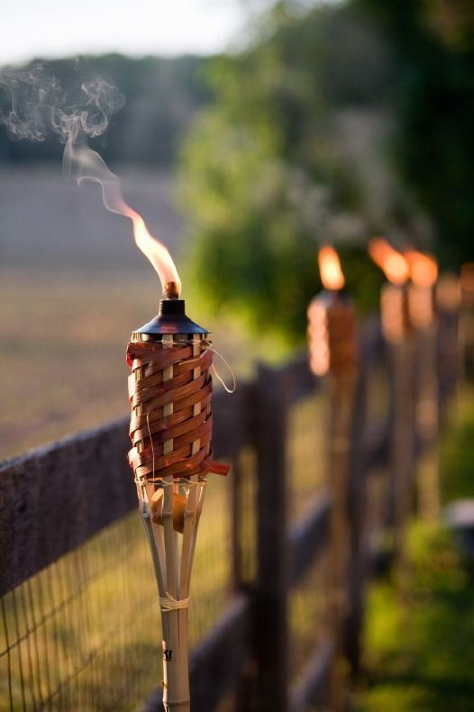
 - Um mural ou espaço para escrever mensagens/alfinetar post-its? é bem coisa de jovem, mas combina com o role de fim de ano, deixar mensagens, desejos, etc; 
 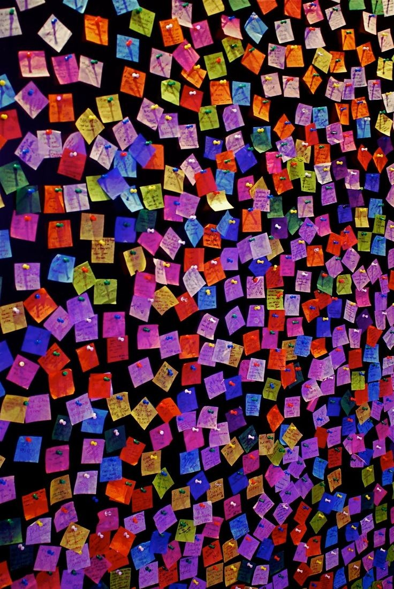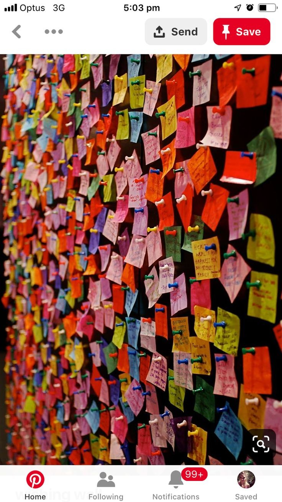
- Posters ou decorações mais simples; 
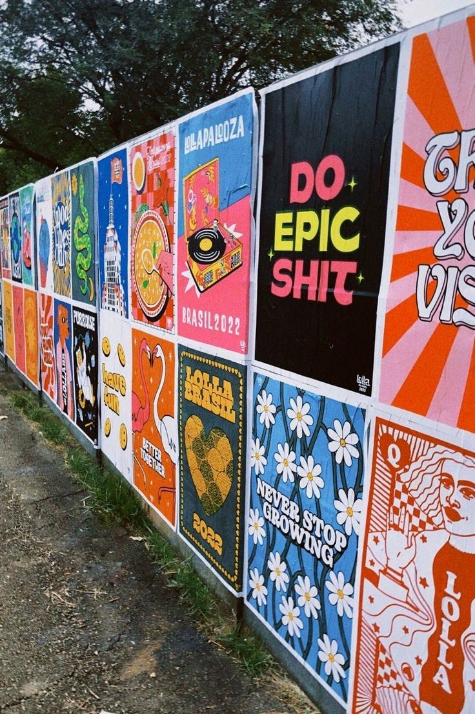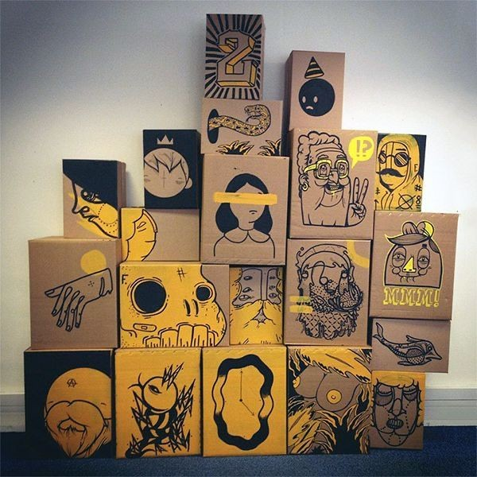
